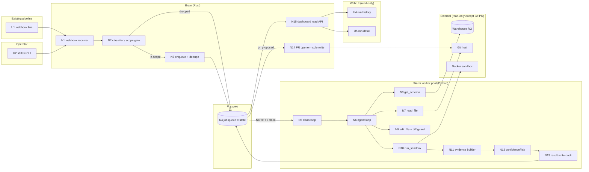

# sibei-flow v1 — Shaping

> The working document for shaping the v1 self-healing wedge. Ground truth for
> **Requirements (R)**, **Shapes**, **Fit Check**, and (later) the breadboard.
>
> **Inputs:** `FRAME.md` (why), `PRD.md` + `CONTEXT.md` (detail), `REQS.md`
> (seed). The ten ADRs in `adr/` are **locked constraints** — shapes live
> inside them; they are not re-litigated here.
>
> **Steps (this doc is built up across sessions):**
> 1. Build R (requirements) — ✅ done
> 2. Sketch S (3 shapes) — ✅ done
> 3. Fit Check (R × S) — ✅ done
> 4. Spikes for flagged rows — ✅ done (Shape B, in `SPIKE-B.md`)
> 5. Select + detail the chosen shape — ✅ **Shape B selected + detailed below**
> 6. Slice (→ Slicing phase) — ✅ done in `SLICES.md` + `V1-plan.md … V5-plan.md`

---

## Requirements (R)

Requirements state **what's needed**, not how it's satisfied (satisfaction
shows up in the fit check). ADRs fix *mechanisms*; each R below captures the
underlying *need* the mechanism serves, so shapes can be compared honestly.

Top-level requirements are chunked (≤9) with sub-requirements. Status legend:
**Core goal · Must-have · Nice-to-have · Undecided · Out**.

| ID | Requirement | Status |
|----|-------------|--------|
| **R0** | **When a dbt-in-Airflow run breaks from schema drift or a code/SQL error, the team gets a correct, ready-to-review fix — without hand-diagnosing it at 3am.** | Core goal |
| **R1** | **Adoption is additive, reversible, and light** — no migration, no new DSL, no cluster. | Must-have |
| R1.1 | Stand up the whole system with `docker compose up` on a laptop or single VM. | Must-have |
| R1.2 | Enroll an existing pipeline by adding a single config/webhook line — no rewrite. | Must-have |
| R1.3 | dbt-running-inside-Airflow is supported first-class at launch (the flagship path). | Must-have |
| R1.4 | A cron/script step with no failure callback can be wrapped (`sbflow run -- <cmd>`) so its failures are captured too. | Must-have |
| R1.5 | Onboarding secrets are minimal and low-trust: a read-only git token/App + an LLM key; optionally a read-only dev/sample warehouse connection. | Must-have |
| **R2** | **Failures are detected and correctly scoped** — the tool acts only where it's competent. | Must-have |
| R2.1 | Detection works without granting standing access to the team's infrastructure. | Must-have |
| R2.2 | Detection hands over a structured payload (task/model id, error, run context), not scraped logs. | Must-have |
| R2.3 | Only in-scope failure classes (schema drift, code/SQL errors) are acted on. | Must-have |
| R2.4 | Out-of-scope classes (OOM/resource, data-quality, timeout) are recognized and **not** turned into fix attempts. | Must-have |
| **R3** | **Fixes are drafted by a provider-agnostic agent the user controls** — privacy-first, bounded, honest about its limits. | Must-have |
| R3.1 | The agent reads the failing source read-only; it never needs write access to diagnose. | Must-have |
| R3.2 | The user brings their own LLM provider — a local or OpenAI-compatible model is first-class, not a bolted-on second path; source/schema/sample data never leave an account the user controls. | Must-have |
| R3.3 | The agent is bounded: it gives up cleanly after a capped number of attempts and says it couldn't fix this one, rather than looping or shipping a guess. | Must-have |
| R3.4 | A fix that would require a prod-side action (e.g. a backfill) is surfaced as a **recommendation only**, never assumed. | Must-have |
| **R4** | **A fix is verified before a human ever sees it** — no junk in the review queue. | Must-have |
| R4.1 | Every candidate fix is at least compiled/parsed; a fix that can't compile never becomes a PR. | Must-have |
| R4.2 | When a read-only sample/dev target is configured, the fix is also run against real-shaped data before the human sees it. | Must-have |
| R4.3 | The evidence shown is accurate and discloses which verification tiers actually ran (tier-2 absence is stated, not hidden). | Must-have |
| **R5** | **The fix arrives as a reviewable Pull Request that a human can trust in seconds.** | Must-have |
| R5.1 | The fix is a normal PR that flows through the team's existing review/CI/audit unchanged. | Must-have |
| R5.2 | The PR carries a plain-English explanation of what changed upstream and why the fix addresses it. | Must-have |
| R5.3 | The PR carries the agent's full reasoning transcript (auditable "show your work"). | Must-have |
| R5.4 | The PR carries a confidence score and a risk class, so reviewers calibrate their scrutiny. | Must-have |
| R5.5 | The diff is minimal and legible, so blast radius is obvious. | Must-have |
| R5.6 | The fix appears within roughly 90 seconds of the failure. | Must-have |
| **R6** | **Trust and safety hold by construction** — adoptable without a security veto. | Must-have |
| R6.1 | The system never holds prod-write credentials and never writes to `main` or prod tables; this is structural, not policy. | Must-have |
| R6.2 | The only write action anywhere in the system is opening a PR on a branch. | Must-have |
| R6.3 | Approving is nothing more than merging the PR; there is no second tool or approval surface. | Must-have |
| R6.4 | Rejecting is closing the PR, and rolling back a merged fix is a `git revert`. | Must-have |
| R6.5 | v1 is strictly propose-and-approve — nothing is ever auto-applied. | Must-have |
| **R7** | **Operation is durable and safe under retries** — a crash or a duplicate never corrupts state or drops a failure. | Must-have |
| R7.1 | A repair job survives a brain restart mid-run — a crash doesn't silently drop the failure. | Must-have |
| R7.2 | A re-delivered/duplicate failure is safe under at-least-once delivery: at worst it yields a second PR proposal, never corrupted state. | Must-have |
| R7.3 | Job state is durably recorded (Postgres source of truth), so activity is never lost. | Must-have |
| **R8** | **The team has one read-only place to see what the tool did.** | Must-have |
| R8.1 | A run history lists every failure the tool saw and what it did about it. | Must-have |
| R8.2 | Any run can be opened to see the transcript, diff, and evidence in the browser. | Must-have |
| R8.3 | The web UI is explicitly read-only — no ambiguity that approval lives in the PR. | Must-have |

**Notes on scope of R:**

- **Requirements track needs; ADRs fix the mechanisms.** E.g. R6.1 is the need
  "adoptable without a security review veto"; the *how* (git-read + PR-only) is
  ADR-0005 and will appear in the shapes.
- **R5.6 (~90s)** is treated as Must-have because it is the acceptance /
  demo bar, not a soft target.
- **R4.2 is conditional** (only when a sample/dev connection is configured) but
  the *capability* is Must-have; its absence must be disclosed (R4.3), which is
  why it isn't Nice-to-have.
- Requirements deliberately **exclude** anything CONTEXT §8 puts out of scope
  (extra failure classes, autonomy, prod mutation, phase-B primitives,
  multi-tenancy, hosted inference, chat notifications). Those are not R's.

---

## Shapes (S)

Three mutually exclusive approaches — pick one. Because the ADRs already fix the
*fundamentals* (Rust brain ⇄ Python worker, webhook-first detection,
git-read + PR-only apply, tiered Docker sandbox, own agent loop, Postgres
state), the shapes **do not** diverge on those. They diverge on the genuinely
open design question the ADRs leave unanswered:

> **How does a repair job cross the brain⇄worker seam — and where does durable
> state, sandbox authority, and at-least-once safety live?**

The PRD calls this seam "the primary integration seam ... designed to remain
stable into phase B," so it is the right axis to fork on. Each shape is a
complete v1 architecture; they differ on the spine. Parts flagged ⚠️ are
described but not yet concretely understood (they fail the fit check until
resolved — that's expected for exploratory shapes).

### The forking axes (how to read the three shapes)

| Axis | Shape A | Shape B | Shape C |
|------|---------|---------|---------|
| Worker lifecycle | Long-lived **service** | Stateless **queue-claimer** | Per-job **subprocess** |
| Brain⇄worker transport | Versioned **RPC** (HTTP/gRPC) | **Postgres job queue** (no direct call) | **stdio contract** + in-loop tool-RPC |
| Sandbox authority | Worker owns Docker | Worker owns Docker | **Brain executor** owns Docker; worker has none |
| Durability / at-least-once | Brain re-dispatches in-flight jobs on restart | **Lease + visibility timeout** (expiry → re-claim) | Brain re-spawns job on restart |
| Detection→dispatch coupling | Synchronous | Decoupled via queue | Synchronous |

---

### A: Service seam — long-lived worker behind a versioned RPC

The brain and worker are two long-running services. On a failure the brain
persists a repair job, then makes a **synchronous versioned RPC** to the worker
and awaits a `RepairResult`. The worker owns the agent loop *and* its own
ephemeral Docker sandbox (talks to the host Docker daemon). Clean, familiar
service boundary; the worker can later be scaled/replaced independently.

| Part | Mechanism | Flag |
|------|-----------|:----:|
| **A1** | **Detection surface** — brain exposes an HTTP webhook receiver; ship a tiny Airflow `on_failure_callback` snippet + dbt run-results hook that POST a structured payload; `sbflow run -- <cmd>` CLI wrapper posts the same shape for cron. | |
| **A2** | **Scope gate** — a classifier maps the payload to a failure class and dispatches only schema-drift / code-SQL; other classes are recorded and dropped. | ⚠️ |
| **A3** | **Repair-job record** — brain writes a coarse durable job row to Postgres with status transitions (received→classified→dispatched→verifying→terminal). | |
| **A4** | **RPC contract** — versioned `RepairJob → RepairResult` over HTTP/JSON (or gRPC); brain dispatches and awaits; timeouts/retries owned by brain. | ⚠️ |
| **A5** | **Worker service** — long-lived Python `sbflow-agent`; runs the agent loop (`read_file`/`edit_file`/`run_sandbox`/`get_schema`) behind `LlmProvider`; capped at ≤N attempts, clean give-up. | |
| **A6** | **Sandbox (worker-owned)** — worker spawns an ephemeral Docker container (Python + dbt) against the host daemon; tiered verification (compile always; sample if a read-only dev connection is configured). | ⚠️ |
| **A7** | **Drift/schema context** — `get_schema` pulls current upstream shape from the configured read-only warehouse connection and diffs it against the model's referenced columns. | ⚠️ |
| **A8** | **Result assembly** — worker returns `{diff, explanation, transcript, evidence, confidence, risk_class, outcome}`; diff constrained to be minimal. | ⚠️ |
| **A9** | **PR open (sole write)** — brain holds the scoped git PR token and opens the PR from the diff + evidence; never touches `main`/prod. | |
| **A10** | **Crash recovery** — on restart the brain finds jobs stuck in non-terminal status and re-dispatches them (at-least-once; human-gated so a dup = a 2nd PR). | ⚠️ |
| **A11** | **Read-only dashboard** — Rust brain serves run history + per-run transcript/diff/evidence; no write actions. | |
| **A12** | **Packaging** — one `docker compose up` brings up brain + worker + Postgres; onboarding = one webhook line + git token + LLM key (+ optional sample connection). | |

---

### B: Queue seam — stateless worker claims jobs from Postgres

There is **no direct call** between brain and worker. The brain writes the
repair job into Postgres as a durable queue row; one or more **stateless**
Python workers claim jobs with `SELECT … FOR UPDATE SKIP LOCKED` + a lease,
run the loop, and write the `RepairResult` back as a row; the brain observes
the terminal row and opens the PR. Durability and at-least-once **fall out of
the queue** — a crashed worker's lease expires and the job is re-claimed. This
spine is the closest seed of the phase-B unified task queue.

| Part | Mechanism | Flag |
|------|-----------|:----:|
| **B1** | **Detection surface** — same as A1 (webhook + Airflow/dbt hooks + `sbflow run --`). | |
| **B2** | 🟡 **Scope gate** — pattern classifier at ingest (adapter-aware error-pattern table); only schema-drift / code-SQL enqueued, out-of-scope + unknown recorded and dropped (→ B-S1). | |
| **B3** | 🟡 **Postgres job queue** — repair job persisted as a queue row with state + lease columns; this row **is** the durable state model. Brain `NOTIFY`s on enqueue (→ B-S6). | |
| **B4** | **Claim protocol** — worker `LISTEN`s + claims with `FOR UPDATE SKIP LOCKED` under a lease (visibility timeout); on completion writes result + marks terminal; on crash the lease expires and another worker re-claims. *(Canonical durable-queue pattern — understood.)* | |
| **B5** | 🟡 **Warm worker pool** — small standing pool of Python worker processes (≥1 warm, avoids cold-start on the hot path); agent loop + `LlmProvider`, capped ≤N; each holds no durable state of its own (→ B-S6). | |
| **B6** | 🟡 **Sandbox (worker-owned)** — ephemeral Docker from a **pre-baked** Python+dbt image; tier-1 `dbt compile` always, tier-2 `dbt build` on 10k sample when a read-only dev connection is configured (→ B-S2). | |
| **B7** | 🟡 **Drift/schema context** — `get_schema` reads current upstream columns from `INFORMATION_SCHEMA` over the read-only warehouse connection and diffs against the model's referenced columns (→ B-S1). | |
| **B8** | 🟡 **Result written to queue** — worker writes `{diff, explanation, transcript, evidence, confidence, risk_class, outcome}` back to the job row; evidence is structured + discloses tiers run; diff held minimal by targeted edits + a diff guard (→ B-S2, B-S4, B-S5). | |
| **B9** | **PR open (sole write)** — brain watches for terminal `pr_proposed` rows and opens the PR; git token stays in the brain, not the workers. | |
| **B10** | 🟡 **At-least-once safety** — idempotency key `hash(repo, run_id, task_id, node_uid)` with `INSERT … ON CONFLICT DO NOTHING` collapses re-deliveries; worst case a second, harmless, human-gated PR (→ B-S7). | |
| **B11** | **Read-only dashboard** — brain serves history/transcript/diff/evidence, reading the same job rows. | |
| **B12** | **Packaging** — `docker compose up` brings up brain + Postgres + N workers; scaling = add worker replicas; onboarding same as A12. | |

---

### C: Embedded seam — per-job worker subprocess; brain owns the sandbox

On each failure the brain **spawns the Python worker as a short-lived
subprocess** (JSON over stdio). The distinguishing move: the **sandbox is owned
by the brain's Executor trait** (ADR-0008), not the worker. The worker is pure
agent logic with **zero infrastructure credentials** — when it wants to compile
or run a candidate, it emits a `run_sandbox` tool-call back across the stdio
boundary and the brain fulfills it through its Executor. Maximizes the security
story and puts the executor seam on the critical path from day one, at the cost
of a chattier in-loop protocol.

| Part | Mechanism | Flag |
|------|-----------|:----:|
| **C1** | **Detection surface** — same as A1. | |
| **C2** | **Scope gate** — classifier before spawn; only in-scope classes spawn a worker. | ⚠️ |
| **C3** | **Repair-job record** — coarse durable job row in Postgres, status transitions as in A3. | |
| **C4** | **Subprocess + stdio contract** — brain spawns `sbflow-agent` per job; `RepairJob` in on stdin, streamed tool-calls + final `RepairResult` on stdout; process exits when done. | ⚠️ |
| **C5** | **Credential-less worker** — worker runs the loop + `LlmProvider` but has **no** Docker daemon access, no git token, no warehouse creds; capped ≤N attempts. | |
| **C6** | **Brain-owned sandbox via Executor** — worker's `run_sandbox`/`get_schema` tool-calls are RPC'd back to the brain, which runs the ephemeral Docker container through the ADR-0008 Executor trait (local backend) and returns results/evidence. | ⚠️ |
| **C7** | **Drift/schema context** — `get_schema` is a brain-mediated call to the read-only warehouse connection (worker never sees the credential). | ⚠️ |
| **C8** | **Result assembly** — brain collects tool evidence + worker's final `{diff, explanation, transcript, confidence, risk_class, outcome}`; brain is the authority on evidence since it ran the tiers. | ⚠️ |
| **C9** | **PR open (sole write)** — brain opens the PR; it already holds every credential, so the trust boundary is a single process. | |
| **C10** | **Crash recovery** — brain re-spawns non-terminal jobs on restart; a dead subprocess is just a re-spawn. | ⚠️ |
| **C11** | **Read-only dashboard** — brain serves history/transcript/diff/evidence. | |
| **C12** | **Packaging** — `docker compose up` brings up brain + Postgres (worker is spawned on demand, not a standing service); onboarding same as A12. | |

---

## Fit Check — R × S

Rows are (sub-)requirements with full text; columns are the three shapes.
**Binary only** — ✅ = "we know concretely how this shape satisfies it";
❌ = a mechanism backing it is still a flagged unknown (⚠️) for that shape.
Grouped by top-level R for readability.

| Req | Requirement | Status | A | B | C |
|-----|-------------|--------|:-:|:-:|:-:|
| R0 | When a dbt-in-Airflow run breaks from schema drift or a code/SQL error, the team gets a correct, ready-to-review fix without hand-diagnosing it. | Core goal | ❌ | 🟡✅ | ❌ |
| R1.1 | Stand up the whole system with `docker compose up` on a laptop / single VM. | Must-have | ✅ | ✅ | ✅ |
| R1.2 | Enroll a pipeline by adding a single config/webhook line — no rewrite. | Must-have | ✅ | ✅ | ✅ |
| R1.3 | dbt-inside-Airflow supported first-class at launch (flagship path). | Must-have | ✅ | ✅ | ✅ |
| R1.4 | A cron/script step can be wrapped (`sbflow run -- <cmd>`) to capture its failures. | Must-have | ✅ | ✅ | ✅ |
| R1.5 | Onboarding secrets are minimal/low-trust: read-only git token/App + LLM key (+ optional read-only sample connection). | Must-have | ✅ | ✅ | ✅ |
| R2.1 | Detection works without standing access to the team's infrastructure. | Must-have | ✅ | ✅ | ✅ |
| R2.2 | Detection hands over a structured payload (task/model id, error, run context). | Must-have | ✅ | ✅ | ✅ |
| R2.3 | Only in-scope failure classes (schema drift, code/SQL) are acted on. | Must-have | ❌ | 🟡✅ | ❌ |
| R2.4 | Out-of-scope classes (OOM/resource, data-quality, timeout) are recognized and not turned into fix attempts. | Must-have | ❌ | 🟡✅ | ❌ |
| R3.1 | The agent reads the failing source read-only; no write access to diagnose. | Must-have | ✅ | ✅ | ✅ |
| R3.2 | User brings their own LLM (local/OpenAI-compatible first-class); data never leaves an account they control. | Must-have | ✅ | ✅ | ✅ |
| R3.3 | The agent gives up cleanly after a capped N attempts rather than looping/guessing. | Must-have | ✅ | ✅ | ✅ |
| R3.4 | A fix needing a prod-side action is surfaced as a recommendation only, never assumed. | Must-have | ❌ | 🟡✅ | ❌ |
| R4.1 | Every candidate is compiled/parsed; one that can't compile never becomes a PR. | Must-have | ❌ | 🟡✅ | ❌ |
| R4.2 | When a read-only sample/dev target is configured, the fix is also run on real-shaped data first. | Must-have | ❌ | 🟡✅ | ❌ |
| R4.3 | Evidence shown is accurate and discloses which tiers actually ran. | Must-have | ❌ | 🟡✅ | ❌ |
| R5.1 | The fix is a normal PR flowing through existing review/CI/audit unchanged. | Must-have | ✅ | ✅ | ✅ |
| R5.2 | PR carries a plain-English explanation of the upstream change and the fix. | Must-have | ✅ | ✅ | ✅ |
| R5.3 | PR carries the agent's full reasoning transcript. | Must-have | ✅ | ✅ | ✅ |
| R5.4 | PR carries a confidence score and a risk class. | Must-have | ❌ | 🟡✅ | ❌ |
| R5.5 | The diff is minimal and legible. | Must-have | ❌ | 🟡✅ | ❌ |
| R5.6 | The fix appears within roughly 90 seconds of the failure. | Must-have | ❌ | 🟡✅ | ❌ |
| R6.1 | System never holds prod-write creds and never writes to `main`/prod — structural. | Must-have | ✅ | ✅ | ✅ |
| R6.2 | The only write action anywhere is opening a PR on a branch. | Must-have | ✅ | ✅ | ✅ |
| R6.3 | Approving is merging the PR; no second approval surface. | Must-have | ✅ | ✅ | ✅ |
| R6.4 | Rejecting is closing the PR; rollback is `git revert`. | Must-have | ✅ | ✅ | ✅ |
| R6.5 | v1 is strictly propose-and-approve — nothing auto-applied. | Must-have | ✅ | ✅ | ✅ |
| R7.1 | A repair job survives a brain restart mid-run — no failure silently dropped. | Must-have | ❌ | ✅ | ❌ |
| R7.2 | A duplicate/re-delivered failure is safe: at worst a second PR, never corrupted state. | Must-have | ❌ | 🟡✅ | ❌ |
| R7.3 | Job state is durably recorded (Postgres source of truth). | Must-have | ✅ | ✅ | ✅ |
| R8.1 | A run history lists every failure seen and what was done. | Must-have | ✅ | ✅ | ✅ |
| R8.2 | Any run can be opened to see transcript, diff, and evidence in the browser. | Must-have | ✅ | ✅ | ✅ |
| R8.3 | The web UI is explicitly read-only. | Must-have | ✅ | ✅ | ✅ |

### Flagged-row analysis (why each flagged row passes or is flagged, per shape)

Each row below that carries at least one ❌ is detailed here: the **reason**
it's non-trivial, the **per-shape verdict** with rationale, what was **assumed**,
and what would move it **from flagged → OK**.

**R0 — Core goal (A ❌ · B ❌ · C ❌).**
- *Reason:* R0 is the aggregate — it holds only when the drift-detection,
  sandbox-verification, and result-assembly mechanisms beneath it hold. Those
  are flagged everywhere.
- *Per shape:* Flagged in all three, transitively, because each depends on the
  shared flagged parts (drift context, sandbox, evidence, minimal diff).
- *Assumed:* An LLM can produce a correct column-rename fix given source + a
  schema diff (plausible; it's the demo's happy path).
- *To OK:* R0 flips to ✅ automatically once R2.3, R4.1–4.3, R5.5 resolve for
  the chosen shape (proven by the end-to-end acceptance test, PRD Seam 3).

**R2.3 / R2.4 — Scope classification (A ❌ · B ❌ · C ❌).**
- *Reason:* A webhook payload from Airflow/dbt carries an error string + task
  context; deciding "this is schema drift / a code-SQL error" vs "this is
  OOM / timeout / data-quality" reliably enough to *act* (R2.3) or *safely
  drop* (R2.4) is a real classification problem, not a lookup.
- *Per shape:* Identical mechanism in all three (classifier at ingest, part
  A2/B2/C2) — flagged uniformly. Shape does not change the difficulty.
- *Assumed:* dbt's `run_results.json` + exception type/text carry enough signal
  to classify without executing anything.
- *To OK:* Spike the dbt/Airflow failure payloads; define a rule/heuristic
  (error-type + message patterns + dbt node status) that separates the two
  in-scope classes from the out-of-scope ones, with an "unknown → drop, don't
  guess" default.

**R3.4 — `needs_prod_action` recommendation (A ❌ · B ❌ · C ❌).**
- *Reason:* Recognizing that a compiling fix still requires a human prod action
  (e.g. a backfill) — and emitting it as a recommendation rather than a PR that
  silently assumes prod is safe — needs a defined signal, not just a hunch.
- *Per shape:* Same result-classification mechanism (A8/B8/C8) everywhere —
  flagged uniformly.
- *Assumed:* The set of "needs prod action" cases in v1 scope is small and
  detectable (e.g. a fix that changes a column's stored data, not just the
  model SQL).
- *To OK:* Spike a concrete rule for when `outcome = needs_prod_action` is
  emitted, and confirm the contract carries it without any prod write.

**R4.1 / R4.2 / R4.3 — Sandbox + tiered verification + honest evidence
(A ❌ · B ❌ · C ❌).**
- *Reason:* The product's entire credibility ("verified before a human sees
  it") rests here. We must actually spin an ephemeral Docker sandbox, run
  `dbt compile` (tier 1) and optionally `dbt build` on a sample (tier 2), and
  emit evidence that is *accurate* and *discloses which tiers ran*.
- *Per shape:* A/B — the **worker** owns the sandbox and reports evidence
  (flagged: mechanics unbuilt; evidence integrity relies on trusting the
  worker's report). C — the **brain's Executor** runs the sandbox, so evidence
  is authoritative by construction (still flagged only because unbuilt; once
  built, C's R4.3 is structurally stronger). Binary: all ❌ (unbuilt).
- *Assumed:* A Python+dbt Docker image can be pre-baked so tier-1 compile is
  fast; a read-only sample connection is available for tier-2 when configured.
- *To OK:* Spike the sandbox image, the exact `dbt compile`/`dbt build`
  invocations, how pass/fail and the "tier-2 not run" disclosure are captured,
  and the rule that **no PR is opened unless tier-1 passes** (story 17).

**R5.4 — Confidence score + risk class (A ❌ · B ❌ · C ❌).**
- *Reason:* A number/label the reviewer trusts must be derived from something
  real (which tiers passed, diff size, whether drift was unambiguous), not an
  LLM's self-graded vibe.
- *Per shape:* Same derivation mechanism everywhere — flagged uniformly.
- *Assumed:* A rubric over verification signals + diff characteristics is good
  enough for v1 (these are *informational* in v1, ADR-0003).
- *To OK:* Spike a concrete, explainable rubric (inputs → confidence/risk) that
  the PR can display and justify.

**R5.5 — Minimal, legible diff (A ❌ · B ❌ · C ❌).**
- *Reason:* LLMs happily reformat whole files; a minimal diff is what makes
  blast radius obvious (R5.5) and the demo legible. Constraining the edit is a
  real mechanism.
- *Per shape:* Same `edit_file` tool discipline everywhere — flagged uniformly.
- *Assumed:* Line-scoped edits + a post-edit diff check can hold the change to
  the failing model.
- *To OK:* Spike the edit tool contract (targeted edits, not full-file rewrites)
  + a guard that rejects/re-drafts oversized diffs.

**R5.6 — ~90s end-to-end latency (A ❌ · B ❌ · C ❌).**
- *Reason:* The demo bar. Budget = detect + classify + read + N×(LLM draft +
  sandbox verify) + PR open, within ~90s. The dbt/Docker **sandbox cold start**
  dominates in every shape.
- *Per shape:* Ordering of *added* overhead (all still ❌ until proven):
  **A** (warm worker, one cold sandbox) < **C** (subprocess spawn + chatty
  in-loop tool-RPC round-trips + cold sandbox) ≈ **B** (poll interval + cold
  worker + cold sandbox). B's poll latency is mitigable with Postgres
  `LISTEN/NOTIFY`; C's per-tool-call round-trips are intrinsic to its protocol.
- *Assumed:* One or two LLM iterations for the flagship rename case; a
  pre-warmed sandbox image.
- *To OK:* Spike a measured latency budget on the flagship scenario (pre-baked
  image, warm/pooled sandbox, `LISTEN/NOTIFY` for B) showing p50 ≤ ~90s.

**R7.1 — Survive brain restart mid-run (A ❌ · B ✅ · C ❌).**
- *Reason:* A crash must not drop a failure on the floor (ADR-0009, story 26).
- *Per shape:* **B ✅** — jobs live in the Postgres queue; a brain restart
  doesn't touch in-flight workers, and a worker crash is recovered by lease
  expiry → re-claim (canonical pattern, B4). **A ❌** — an in-flight synchronous
  RPC is lost on brain restart; re-dispatch must reconcile a possibly-still-
  running worker + its orphaned sandbox (unbuilt). **C ❌** — the per-job
  subprocess is orphaned/killed with the brain; re-spawn must clean up the
  brain-owned sandbox container it left behind (unbuilt).
- *Assumed (B):* Standard `SKIP LOCKED` + visibility-timeout semantics.
- *To OK (A/C):* Design + prove the reconcile-on-restart path incl. orphaned
  sandbox/subprocess cleanup.

**R7.2 — Duplicate/re-delivery safe → at worst a 2nd PR (A ❌ · B ❌ · C ❌).**
- *Reason:* At-least-once delivery (ADR-0009, story 27) means the same failure
  can arrive twice; the system must never corrupt state, at worst propose twice.
- *Per shape:* Same idempotency concern everywhere (A10/B10/C10) — flagged
  uniformly; B's lease handles worker-crash dup but not webhook re-delivery dup.
- *Assumed:* A natural idempotency key exists on (repo, run_id, task_id).
- *To OK:* Spike the dedup key + the "human-gated so a dup is safe" argument;
  confirm a re-delivery collapses to one job when the key matches, else yields a
  second harmless PR proposal.

### Selection input

No shape is disqualified; coverage is near-identical. The decision rests on
three tilts the binary grid doesn't show:
- **Durability / phase-B fit → B.** B uniquely passes R7.1 and its Postgres job
  queue *is* the deliberate seed of the phase-B unified state machine (PRD
  "Phase-B seeding"), so v1 → phase-B is a graduation, not a rewrite.
- **Safety → C**, then B, then A. But C buys it with a bespoke bidirectional
  in-loop tool-RPC protocol — the most build-risk under a solo ~6-week appetite.
- **Latency / build simplicity → A**, but A is the weakest phase-B seed and
  fails R7.1.

**Chosen shape: B (queue seam).** It is the closest to a full R × S fit (only
shape passing R7.1), the truest phase-B seed, and its one real weakness
(latency) is mitigable (`LISTEN/NOTIFY` + pre-baked/pooled sandbox) rather than
intrinsic. Its flagged rows — **R2.3, R2.4, R3.4, R4.1, R4.2, R4.3, R5.4, R5.5,
R5.6, R7.2** (R0 resolves transitively) — are spiked in `SPIKE-B.md` and all
resolve to OK; **the B column of the fit check above is now fully ✅** (A and C
remain unspiked — they were not selected).

---

## Detail B — concrete affordances (queue seam)

Expansion of the selected shape into concrete affordances and wiring (not a new
alternative). Every affordance below traces to a resolved part / spike; **no ⚠️
remain**, so the shape is ready to slice.

### UI Affordances (what people see / touch)

| Affordance | Place | Description | Wires out |
|---|---|---|---|
| **U1 webhook line** | Existing pipeline | One-line Airflow `on_failure_callback` snippet (and dbt hook) POSTing the failure payload; `sbflow run -- <cmd>` for cron. | → N1 |
| **U2 `sbflow` CLI** | Operator shell | `sbflow init` (paste read-only git token + LLM key + optional sample conn), `sbflow run --`, local ops. | → N1, configures N3/N9/N11 |
| **U3 the Pull Request** | Git host | The primary surface: minimal diff + plain-English explanation + reasoning transcript + verification evidence + confidence/risk label. **Merge = approve; close = reject; `git revert` = rollback.** | (human action) |
| **U4 run-history list** | Web UI (read-only) | Every failure seen and what was done (class, outcome, timing). | → N15 |
| **U5 run-detail view** | Web UI (read-only) | Transcript, diff, evidence for one run; explicitly no write actions. | → N15 |

### Non-UI Affordances (stores, handlers, services)

| Affordance | Place | Description | Wires out |
|---|---|---|---|
| **N1 webhook receiver** | Brain (Rust) | HTTP endpoint; normalizes Airflow/dbt/CLI payloads to a `Failure` (task/model id, error, run ctx, `run_results` ref). | → N2 |
| **N2 classifier + scope gate** | Brain | Adapter-aware pattern rules → {schema-drift, code-SQL, out-of-scope, unknown}; only in-scope proceed (B-S1, R2.3/R2.4). | → N3 (in-scope) / N15 (dropped) |
| **N3 job enqueue + dedupe** | Brain → Postgres | `INSERT … ON CONFLICT DO NOTHING` on idempotency key `hash(repo,run_id,task_id,node_uid)` (B-S7, R7.2). | → N4 |
| **N4 job queue table** | Postgres | Durable job rows: state, lease, payload, result; the source of truth (R7.3). Brain `NOTIFY`s on insert. | → N5 |
| **N5 claim loop** | Worker pool (Python) | `LISTEN` + `FOR UPDATE SKIP LOCKED` under a lease; crash → lease expiry → re-claim (R7.1). | → N6 |
| **N6 agent loop** | Worker | Bounded ≤N: read → draft → verify → iterate/emit; behind `LlmProvider` (BYO/local, R3.2/R3.3). | → N7,N8,N9,N10 |
| **N7 `read_file`** | Worker (git read-only) | Reads failing source at the failing ref via scoped token (R3.1). | → N6 |
| **N8 `get_schema`** | Worker → Warehouse (read-only) | Reads current columns from `INFORMATION_SCHEMA`; diffs vs referenced columns → drift (B-S1). | → N6 |
| **N9 `edit_file` + diff guard** | Worker | Targeted edits (no full-file rewrite) + deterministic guard rejecting oversized/out-of-scope diffs → re-draft (B-S5, R5.5). | → N6 |
| **N10 `run_sandbox`** | Worker → Docker | Pre-baked Python+dbt container; tier-1 `dbt compile` always, tier-2 `dbt build` on 10k sample if configured; container `--rm` (B-S2, R4.1/R4.2). | → N11 |
| **N11 evidence builder** | Worker | Structured evidence `{tier1, tier2(ran?), output_schema.changed}`; tier-2 absence rendered, not hidden (B-S2, R4.3). | → N12 |
| **N12 confidence/risk scorer** | Worker | Explainable rubric over tiers-passed, diff size, drift ambiguity, attempts → confidence + risk (B-S4, R5.4). | → N13 |
| **N13 result write-back** | Worker → Postgres | Writes `{diff, explanation, transcript, evidence, confidence, risk, outcome ∈ {pr_proposed,no_fix,needs_prod_action}}` to the job row; `needs_prod_action` when `incremental` + non-rename drift (B-S3, R3.4). | → N14 |
| **N14 PR opener (sole write)** | Brain → Git host | Watches terminal `pr_proposed` rows; opens a PR on a branch with U3's contents. Only write action anywhere; no prod-write creds (R6.1/R6.2). | → U3 |
| **N15 dashboard read API** | Brain → Web UI | Read-only queries over job rows for U4/U5 (R8). | → U4,U5 |

### Wiring (grouped by Place)

### Readiness check

| Requirement group | Covered by | Status |
|---|---|---|
| R1 adoption | U1, U2, N14 packaging, `docker compose up` | ✅ |
| R2 detect + scope | N1, N2 (B-S1) | ✅ |
| R3 agent | N6, N7, N8, N13 (B-S3) | ✅ |
| R4 verify + evidence | N10, N11 (B-S2) | ✅ |
| R5 PR trust | U3, N9, N12, N13, N14 (B-S4/S5); latency B-S6 | ✅ |
| R6 safety | N14 sole write, RO tokens, U3 approval, read-only Web UI | ✅ |
| R7 durable/retry | N3, N4, N5 (B-S7); R7.1 by lease | ✅ |
| R8 observability | N15, U4, U5 | ✅ |

**No ⚠️ remain — Shape B is ready to slice.** Slicing is done: see `SLICES.md`
(slice map V1–V5 + sliced breadboard) and the per-slice plans `V1-plan.md …
V5-plan.md`.
