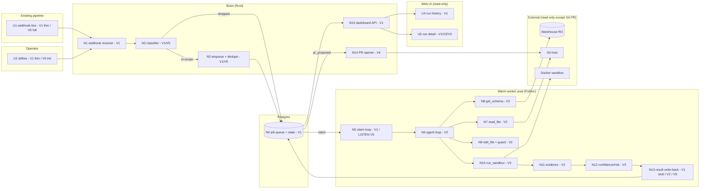

# sibei-flow v1 — Slices (Shape B)

> The implementation plan: Shape B (queue seam) broken into **vertical slices**,
> each ending in demo-able output. Ground truth for slice definitions and the
> sliced breadboard. Detail per slice lives in `V1-plan.md … V5-plan.md`.
>
> **Derived from** `SHAPING.md` → *Detail B* (affordances U1–U5, N1–N15). Changes
> to a slice's scope ripple **up** to `SHAPING.md` and **down** to its slice plan.
>
> **Slicing rule:** every slice ends in something a person can *see* (a
> dashboard row, a drafted diff, a PR). No horizontal "data-model-only" slices.

---

## Slice map (build order)

Each slice is a thin vertical cut through the whole stack that leaves a working,
demoable system. Later slices thicken the same spine — they don't bolt on
detached layers.

| Slice | Title | The demo (visible output) | Net-new affordances |
|-------|-------|---------------------------|---------------------|
| **V1** | Walking skeleton — failure in, run out | POST a failure payload (or fail a dbt run) → a classified run appears in the read-only web dashboard with `outcome = no_fix`. | N1, N2\*, N3\*, N4, N5, N13\*, N15, U4, U5\*, packaging |
| **V2** | Drift diagnosis & drafted fix | The same run now shows a **minimal drafted diff**, plain-English explanation, and reasoning transcript for a column-rename drift. | N6, N7, N8, N9, LlmProvider |
| **V3** | Verified before you see it | The run now shows **verification evidence** (compiled ✓ · sample ✓ · schema unchanged ✓) + confidence/risk; non-compiling drafts are suppressed to `no_fix`. | N10, N11, N12, compile gate |
| **V4** | The auto-PR (the wow) | Rename an upstream column → dbt fails → within ~90s a **Pull Request** appears with diff + explanation + transcript + evidence + confidence. Merge → green. | N14, U3 |
| **V5** | Hardening & onboarding | Kill the brain mid-run → run resumes; re-deliver a webhook → one job; wrap a cron step; `sbflow init` onboarding; `needs_prod_action` recommendation. | N3 dedupe, recovery, U1 full, U2 `init`, N13 `needs_prod_action`, latency tuning |

\* = introduced in a **thin** form in this slice and thickened later (see per-slice notes).

---

## Per-slice affordances

Traceability from Detail B (`SHAPING.md`) into each slice. "Thin" means a
minimal first cut; "full" means completed in that slice.

### V1 — Walking skeleton
| Affordance | Scope in V1 |
|---|---|
| N1 webhook receiver | full — accept + normalize Airflow/dbt/CLI payloads to `Failure` |
| N2 classifier | thin — schema-drift / code-SQL / else; small pattern set (grown in V5) |
| N3 enqueue | thin — insert job row (dedupe added in V5) |
| N4 job queue table | full — durable rows, state, lease columns |
| N5 claim loop | full — poll + `SKIP LOCKED` + lease (LISTEN/NOTIFY added in V5) |
| N13 result write-back | thin — writes `outcome = no_fix` stub only (no agent yet) |
| N15 dashboard read API | full — history + detail queries |
| U4 run history | full |
| U5 run detail | thin — class, outcome, timing (diff/evidence added V2/V3) |
| packaging | full — `docker compose up` brings brain + Postgres + worker |

### V2 — Drift diagnosis & drafted fix
| Affordance | Scope in V2 |
|---|---|
| N6 agent loop | full — bounded ≤N read→draft→emit; `LlmProvider` (BYO/local) |
| N7 `read_file` | full — read failing source at ref, git read-only |
| N8 `get_schema` | full — `INFORMATION_SCHEMA` diff → drift |
| N9 `edit_file` + diff guard | full — targeted edits + oversize/scope guard + re-draft |
| N13 result write-back | thicken — now writes diff + explanation + transcript (still no evidence) |
| U5 run detail | thicken — renders drafted diff + explanation + transcript |

### V3 — Verified before you see it
| Affordance | Scope in V3 |
|---|---|
| N10 `run_sandbox` | full — pre-baked Python+dbt image; tier-1 `dbt compile` always, tier-2 `dbt build` on 10k sample if configured |
| N11 evidence builder | full — structured `{tier1, tier2(ran?), output_schema.changed}` with disclosure |
| N12 confidence/risk scorer | full — explainable rubric over signals |
| compile gate | full — `pr_proposed` only if tier-1 passes; else `no_fix` |
| U5 run detail | thicken — renders evidence + confidence/risk |

### V4 — The auto-PR
| Affordance | Scope in V4 |
|---|---|
| N14 PR opener | full — brain watches `pr_proposed` rows, opens branch + PR; sole write action |
| U3 the Pull Request | full — diff + explanation + transcript + evidence + confidence/risk; merge=approve/close=reject/`git revert`=rollback |

### V5 — Hardening & onboarding
| Affordance | Scope in V5 |
|---|---|
| N3 dedupe | full — idempotency key + `ON CONFLICT DO NOTHING` |
| crash recovery | full — lease expiry re-claim + brain-restart reconcile (R7.1/R7.2 proven) |
| N13 `needs_prod_action` | full — `incremental` + non-rename drift → recommendation, no prod write |
| U1 webhook line | full — shipped Airflow snippet + `sbflow run -- <cmd>` cron path |
| U2 `sbflow init` | full — onboarding: git token + LLM key + optional sample conn |
| latency tuning | full — `LISTEN/NOTIFY` dispatch + warm worker pool + pre-baked/warm sandbox → p50 ≤ ~90s |
| N2 classifier | thicken — expand adapter-aware pattern coverage |

---

## Sliced breadboard

The Detail B wiring, colored by the slice that first lights each affordance up.

---

## Test-seam coverage across slices

Mapping to the PRD's three stable seams:

| PRD seam | What it proves | First exercised | Complete by |
|---|---|---|---|
| **Seam 2** — brain webhook→job→dispatch | valid payload → durable job; out-of-scope not dispatched; restart/dup safe | V1 | V5 |
| **Seam 1** — worker contract `RepairJob → RepairResult` | verified-before-seen: no PR on tier-1 fail, evidence reflects tiers run, `no_fix`/`needs_prod_action` | V2 (loop) → V3 (verify) | V5 |
| **Seam 3** — end-to-end acceptance (wow demo) | failure in → PR out with evidence within ~90s | V4 | V4 (hardened in V5) |

`LlmProvider` is the injected test dependency (record/replay) from V2 onward; the
real Docker sandbox is used from V3 (PRD Testing Decisions).

---

## Consistency notes

- **Ground-truth chain:** `SHAPING.md` (R, shapes, Detail B) → **this doc**
  (slices) → `V*-plan.md` (implementation). A scope change in any slice plan
  must ripple up to this doc's slice map and, if it changes a mechanism, to
  Detail B in `SHAPING.md`.
- **No new requirements introduced by slicing.** Every slice traces to existing
  R's and Detail-B affordances; if a slice reveals a missing R, add it to
  `SHAPING.md` first, then re-slice.
- **All slice plans currently carry no ⚠️** — the unknowns were resolved in
  `SPIKE-B.md` before slicing began.
